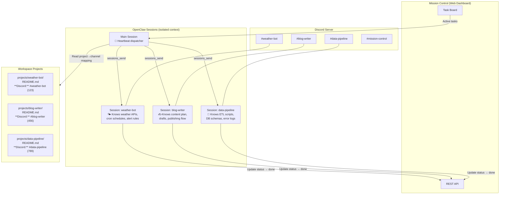
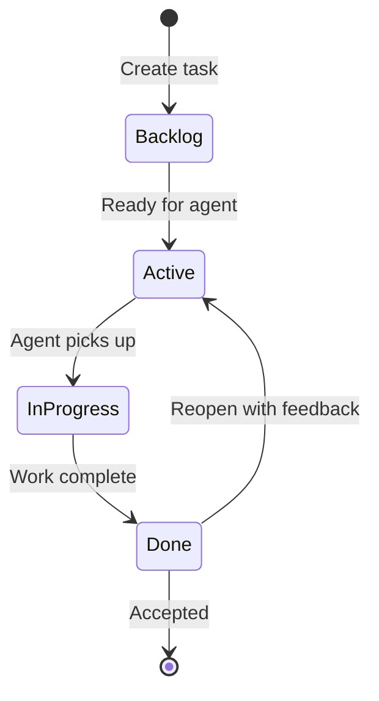
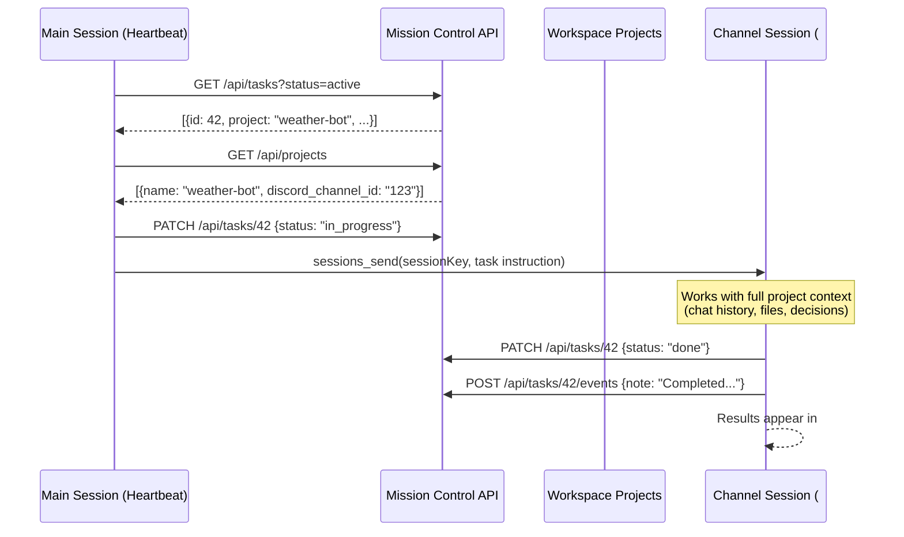

# Mission Control

A lightweight dashboard for managing AI agent tasks, calendar events, and memory — built for [OpenClaw](https://github.com/openclaw/openclaw) workflows.

## Features

- **Task Management** — Create, assign, prioritize, and track tasks with status workflows and event history
- **Calendar** — View and create events with timeline display
- **Memory Browser** — Search and browse agent memory files (MEMORY.md + daily notes)
- **API-first** — Full REST API with Bearer token auth for agent integration
- **Login** — Password-protected dashboard with JWT sessions

## Tech Stack

| Layer | Technology |
|-------|-----------|
| Framework | [Next.js 14](https://nextjs.org/) (App Router) |
| Language | TypeScript |
| Styling | Tailwind CSS |
| Auth | bcryptjs + JSON Web Tokens |
| Database | JSON file (zero-dependency, `data/db.json`) |
| Runtime | Node.js 22+ |

## Prerequisites

- Node.js 22+ (LTS recommended)
- npm

## Installation

```bash
git clone https://github.com/mdude/openclaw-mc.git
cd openclaw-mc
npm install
```

## Configuration

Copy the example env and edit it:

```bash
cp .env.example .env
```

| Variable | Description | Example |
|----------|-------------|---------|
| `PORT` | Server port | `3001` |
| `MC_USER` | Login username | `moxie` |
| `MC_PASS_HASH` | bcrypt hash of login password | _(generate with `npx bcryptjs-cli hash <password>`)_ |
| `MC_JWT_SECRET` | Secret for signing JWT tokens | _(any random string)_ |
| `MC_API_KEY` | Bearer token for API access | `mc-api-key-change-me` |
| `MC_WORKSPACE` | Path to OpenClaw workspace | `/home/ubuntu/.openclaw/workspace` |

### Generating a password hash

```bash
node -e "const b=require('bcryptjs'); console.log(b.hashSync('your-password', 10))"
```

Put the output in `MC_PASS_HASH` (in `.env`) or `.passhash`.

## Development

```bash
npm run dev
```

Opens at `http://localhost:3001/missioncontrol`

## Production Build & Deploy

```bash
npm run build
npm run start
```

### Systemd Service (Linux)

Create `/etc/systemd/system/mission-control.service`:

```ini
[Unit]
Description=Mission Control Dashboard
After=network.target

[Service]
Type=simple
User=ubuntu
WorkingDirectory=/path/to/openclaw-mc
ExecStart=/path/to/openclaw-mc/node_modules/.bin/next start -p 3001
EnvironmentFile=/path/to/openclaw-mc/.env
Restart=on-failure
RestartSec=5

[Install]
WantedBy=multi-user.target
```

Then:

```bash
sudo systemctl daemon-reload
sudo systemctl enable --now mission-control
```

### Nginx Reverse Proxy (Optional)

To serve behind nginx at `/missioncontrol`:

```nginx
location /missioncontrol {
    proxy_pass http://127.0.0.1:3001;
    proxy_http_version 1.1;
    proxy_set_header Upgrade $http_upgrade;
    proxy_set_header Connection 'upgrade';
    proxy_set_header Host $host;
    proxy_set_header X-Real-IP $remote_addr;
    proxy_set_header X-Forwarded-For $proxy_add_x_forwarded_for;
    proxy_set_header X-Forwarded-Proto $scheme;
}
```

> The app is configured with `basePath: '/missioncontrol'` in `next.config.js`.

## API

All API endpoints require either a valid JWT cookie (web login) or `Authorization: Bearer <MC_API_KEY>` header.

### Tasks

| Method | Endpoint | Description |
|--------|----------|-------------|
| `GET` | `/missioncontrol/api/tasks` | List tasks (query: `status`, `project`, `assignee`) |
| `POST` | `/missioncontrol/api/tasks` | Create task (`title` required) |
| `PATCH` | `/missioncontrol/api/tasks/:id` | Update task fields |
| `DELETE` | `/missioncontrol/api/tasks/:id` | Delete task |
| `GET` | `/missioncontrol/api/tasks/:id/events` | Task event history |
| `POST` | `/missioncontrol/api/tasks/:id/events` | Add comment to task |

### Projects

| Method | Endpoint | Description |
|--------|----------|-------------|
| `GET` | `/missioncontrol/api/projects` | List projects (reads from workspace) |

### Events (Calendar)

| Method | Endpoint | Description |
|--------|----------|-------------|
| `GET` | `/missioncontrol/api/events` | List events (query: `start`, `end`) |
| `POST` | `/missioncontrol/api/events` | Create event |

### Memory

| Method | Endpoint | Description |
|--------|----------|-------------|
| `GET` | `/missioncontrol/api/memory/files` | List memory files |
| `GET` | `/missioncontrol/api/memory/files/:path` | Read memory file content |
| `GET` | `/missioncontrol/api/memory/search?q=...` | Search memory entries |
| `POST` | `/missioncontrol/api/memory/reindex` | Re-index memory files |

## Project Structure

```
├── src/
│   ├── app/
│   │   ├── (dashboard)/       # Main pages (tasks, calendar, memory)
│   │   ├── api/               # REST API routes
│   │   └── login/             # Login page
│   ├── components/            # Shared UI components
│   ├── lib/                   # Database, auth, API helpers
│   └── middleware.ts          # Auth middleware
├── data/                      # Runtime data (db.json, gitignored)
├── next.config.js             # Base path + standalone output
├── tailwind.config.ts
└── tsconfig.json
```

## Architecture: Project & Task Management with Discord

Mission Control is designed to work with [OpenClaw](https://github.com/openclaw/openclaw) agents that use Discord as their chat surface. Each project gets its own Discord channel, its own isolated session context, and tasks are automatically dispatched to the right place.

### The Big Picture



### How It Works

**1. Projects live in the workspace**

Each project is a folder under `~/.openclaw/workspace/projects/`. The README contains a Discord channel mapping:

```markdown
# Weather Bot

**Status:** 🟢 Active
**Discord:** #weather-bot (1234567890)

## Description
Automated weather alerts and forecasts.
```

**2. Discord channels provide isolated context**

Each Discord channel has its own OpenClaw session. When you chat in `#blog-writer`, the agent only has context about the blog project. This isolation means:
- No cross-contamination between projects
- The agent can focus on project-specific files, history, and decisions
- `/new` resets the session but keeps the channel mapping

**3. Tasks flow through a lifecycle**



| Status | Who owns it | What happens |
|--------|------------|--------------|
| **Backlog** | Human | Draft — still editing the task |
| **Active** | System | Ready — dispatcher will send to the right channel |
| **In Progress** | Agent | Agent is working on it |
| **Done** | Human | Review — accept or reopen with comments |

**4. The dispatcher connects everything**

The main session runs a heartbeat check (~30 min). It uses `sessions_send` to dispatch tasks directly to the project's channel session — the same session that holds all the project's chat history and context.



> **Key:** `sessions_send` routes the task to `agent:main:discord:channel:<id>` — the actual channel session, not an isolated sub-agent. This requires `tools.sessions.visibility: "agent"` in the OpenClaw config.

### Example Walkthrough

Imagine you have three projects: `weather-bot`, `blog-writer`, and `data-pipeline`.

1. **You create a task** in Mission Control:
   - Title: "Add hourly forecast to weather alerts"
   - Project: `weather-bot`
   - Instruction: "Update the cron job to include hourly forecasts. Use the Open-Meteo API hourly endpoint..."

2. **You move it to Active** when the instruction is complete.

3. **Next heartbeat**, the main session:
   - Finds the task (status: active, project: weather-bot)
   - Looks up `weather-bot` → Discord channel `#weather-bot` (from README)
   - Marks task as In Progress
   - Uses `sessions_send` to dispatch the task instruction to `agent:main:discord:channel:123` (the #weather-bot session)

4. **The `#weather-bot` session** receives the instruction with full project context (knows the cron setup, API keys, file structure, previous conversations), works on the task, and calls the API to mark it complete. Results appear directly in #weather-bot.

5. **You review** in Mission Control. If it's not right, you click Reopen, add a comment ("forecasts should be in Celsius, not Fahrenheit"), and it goes back to Active for another round.

### Setting Up a New Project

Use the `/project <name>` command in any Discord channel:

```
/project weather-bot
```

This creates:
- `~/.openclaw/workspace/projects/weather-bot/README.md` with Discord channel mapping
- The project immediately appears in Mission Control's dropdown
- Tasks assigned to this project will dispatch to that channel

### Key Design Decisions

- **Channel ID, not session ID** — Mapping uses Discord channel IDs which persist across `/new` session resets
- **README as config** — Project metadata lives in markdown, not a database. No system config in the app.
- **Human-in-the-loop** — Tasks go Backlog → Active (human decides when it's ready) and Done → Reopen (human reviews results)
- **API-first** — The agent updates task status via REST API. The dashboard is just a view layer.

## License

MIT
